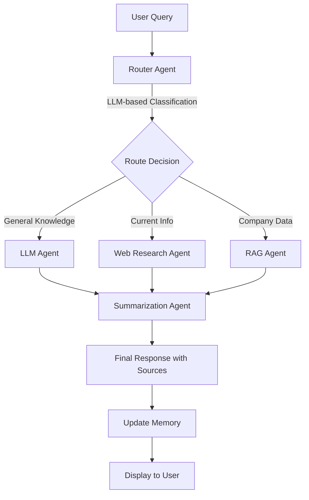
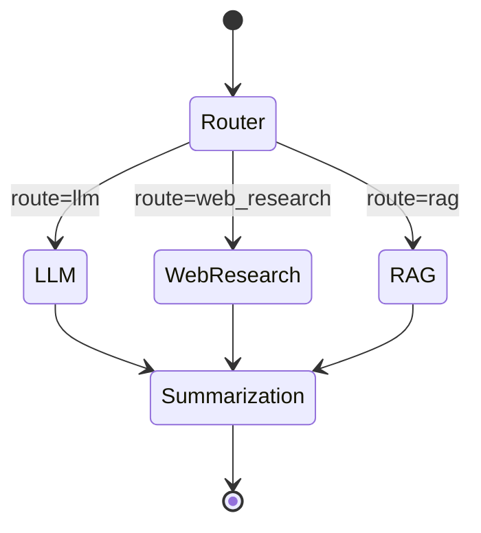
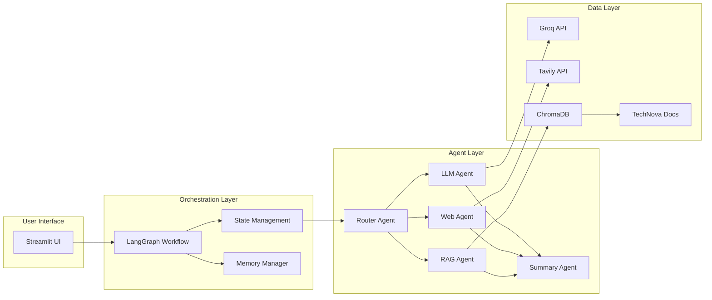
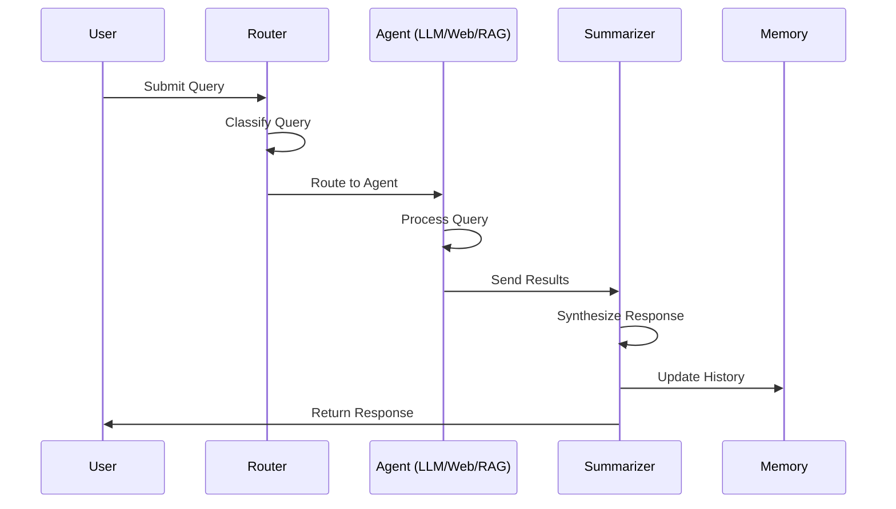
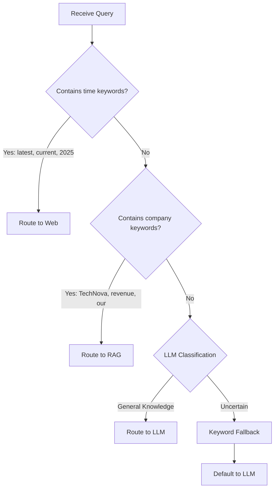
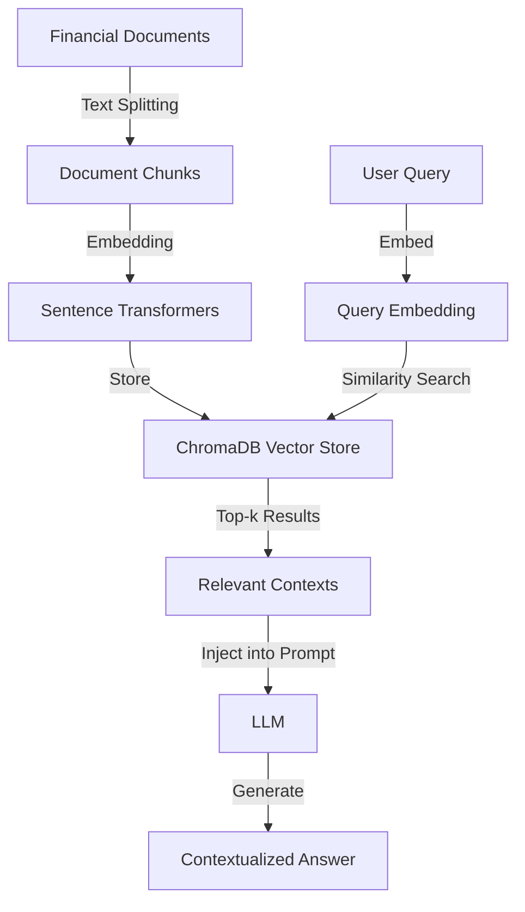
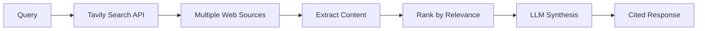
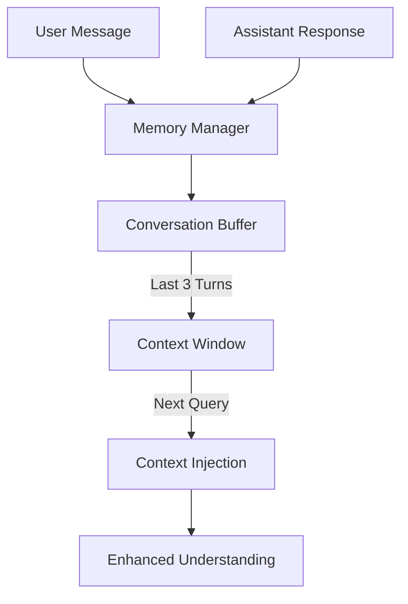
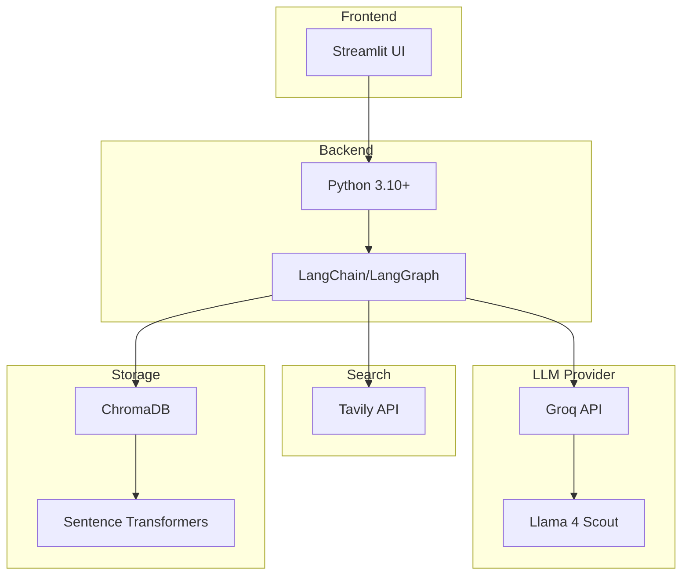

# System Architecture Diagrams

## 1. High-Level System Flow



## 2. LangGraph State Machine



## 3. Component Architecture



## 4. Data Flow



## 5. Router Decision Logic



## 6. RAG System Architecture



## 7. Web Research Flow



## 8. Memory Management



## Routing Examples

### Example 1: General Knowledge
```
Input: "What is machine learning?"
Router: Analyzes → No time words, no company words → LLM
Flow: Router → LLM Agent → Summarizer → Response
```

### Example 2: Current Information
```
Input: "What's the latest AI news?"
Router: Detects "latest" → Web Research
Flow: Router → Web Agent (Tavily) → Summarizer → Response
```

### Example 3: Company Data
```
Input: "TechNova's Q1 revenue?"
Router: Detects "TechNova" → RAG
Flow: Router → RAG Agent (ChromaDB) → Summarizer → Response
```

### Example 4: Follow-up with Memory
```
Query 1: "TechNova Q1 revenue?"
Response 1: "$2.8B" [RAG Agent, stored in memory]

Query 2: "What about Q2?"
Memory: Injects context "Previous: Q1 revenue query"
Router: Detects follow-up pattern → RAG
Flow: Router → RAG Agent (with context) → Summarizer → Response: "$3.2B"
```

## Technology Stack Diagram



---

These diagrams illustrate the complete system architecture, data flow, and decision-making processes implemented in the LangGraph Multi-Agent System.